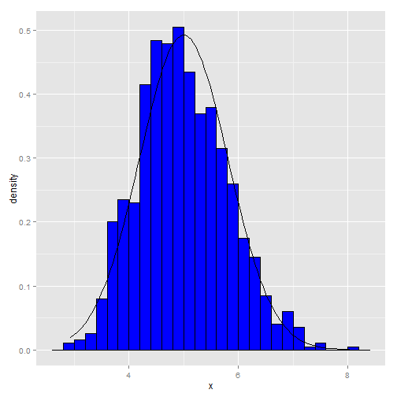

## Problem explanation 

The exponential distribution can be simulated in R with rexp(n, lambda) where lambda is the rate parameter. The mean of exponential distribution is 1/lambda and the standard deviation is also also 1/lambda. Set lambda = 0.2 for all of the simulations. In this simulation, you will investigate the distribution of averages of 40 exponential(0.2)s. Note that you will need to do a thousand or so simulated averages of 40 exponentials.

## Simulation 1000 times for 40 exponentials


```r
lambda = 0.2
n = 40
nsims = 1:1000
set.seed(1000)
means <- data.frame(x = sapply(nsims, function(x) {mean(rexp(n, lambda))}))
head(means)
```

```
##       x
## 1 4.514
## 2 5.051
## 3 3.252
## 4 3.917
## 5 4.898
## 6 3.677
```

1. Show where the distribution is centered at and compare it to the theoretical center of the distribution.

- Mean of my simulation is 4.987 and Expected mean is 5.

- SD of my simulation is 0.8089 and Expected SD is 0.7906.

2. Show how variable it is and compare it to the theoretical variance of the distribution.
x

- Variance of my simulaton is 0.6543 and theoretical variance of the distribution is 0.625.

3. Show that the distribution is approximately normal.


```r
library(ggplot2)
ggplot(data = means, aes(x = x)) + 
    geom_histogram(aes(y=..density..), fill = I('blue'), 
                   binwidth = 0.20, color = I('black')) +
    stat_function(fun = dnorm, arg = list(mean = 5, sd = sd(means$x)))
```

 

4. Evaluate the coverage of the confidence interval for 1/lambda: X±1.96S/sqrt(n).


```r
mean(means$x) + c(-1,1)*1.96*sd(means$x)/sqrt(nrow(means))
```

```
## [1] 4.937 5.037
```

**As above simulations, we know that 
the exponential distribution can be simulated and the mean of exponential distribution is 1/lambda and the standard deviation is also also 1/lambda.**


